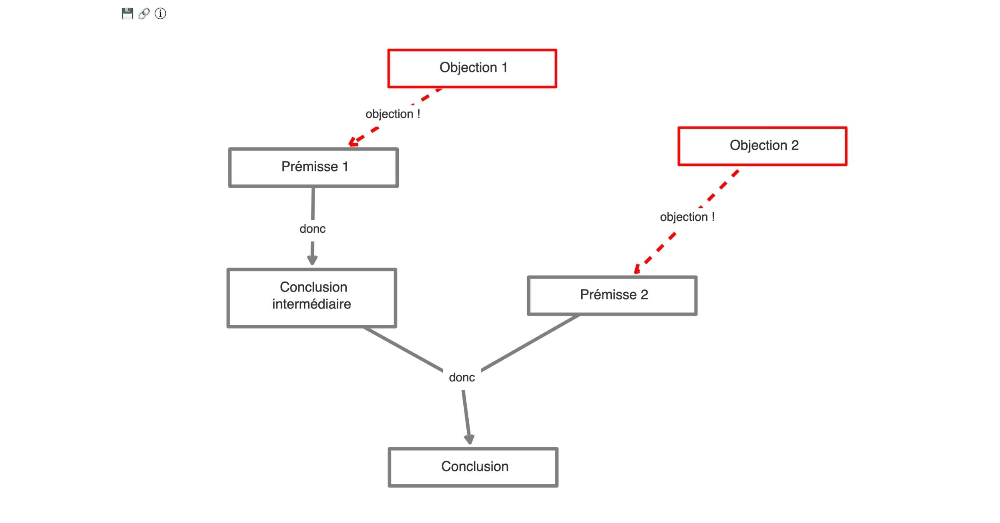

Traduction et adaptation, par [Cédric Eyssette](https://eyssette.github.io/), du logiciel [Reasons](https://github.com/davekinkead/reasons) de [Dave Kinkead](https://github.com/davekinkead/), qui permet de créer des schémas d'arguments.

## Modifications par rapport au logiciel initial

1. Adaptation de l'interface
2. Schéma sauvegardé automatiquement dans la session
3. Possibilité d'inclure des objections
4. Possibilité de partager le schéma grâce à une URL de l'argument
5. Possibilité d'enregistrer le schéma au format PNG

N'hésitez pas me faire des retours ou des suggestions d'amélioration.

## Mode d'emploi

- Pour créer une prémisse ou une objection : Double-clic sur l'écran.
- Pour créer un lien entre un argument (prémisse ou objection) et une idée : glisser-déposer l'argument sur l'idée
- Pour créer des prémisses liées : glisser-déposer chaque prémisse sur la conclusion, puis l'une des prémisses sur l'autre
- Pour naviguer dans l'argumentation : Tabulation
- Pour éditer un élément : Enter ou Double-clic sur l'élément
- Pour supprimer un élément : Delete
- Souris : vous pouvez déplacer ou zoomer sur l'argument
- Retour en arrière : Cmd+z
- Pour sauvegarder : Clic sur 💾 
- Pour partager : Clic sur 🔗 pour obtenir l'URL de l'argument

## Un exemple de schéma

